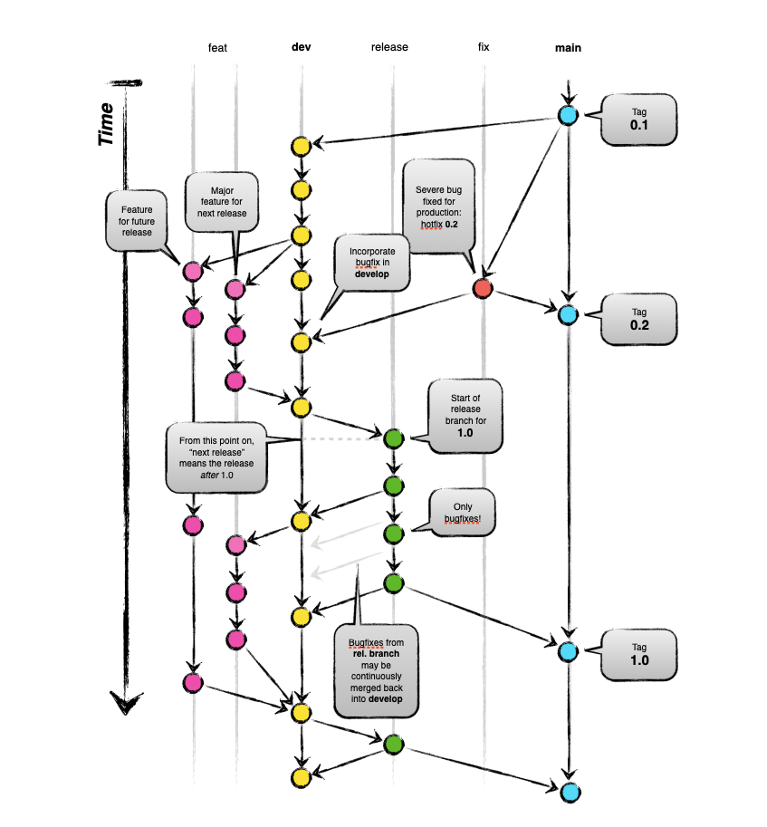
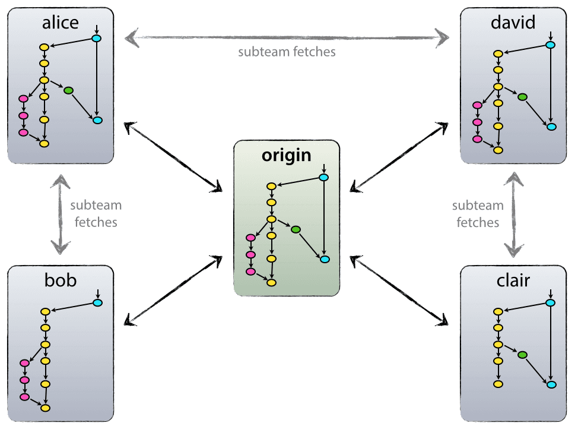

# Git

## Git Branching



> Image Source: [Vincent Driessen](https://nvie.com/about/) 

### Source of Center

#### origin

```bash
git push origin xxxx
git push internal xxxx
git push bitbucket xxxx
git push public xxxx
```




### The Main Branches

#### main and dev

```bash
git checkout -b dev main
```


- `origin/main` – production ready state
- `origin/dev` – 
  - next release developments
  - where automatic nightly builds are build from


When develop for next release done:

1. Merge back to main 
2. Tag with release number

Each time when changes are merged back into `main` this is a new production release by definition

### Supporting Branches

- limited lifetime branches
- parallel development between team members
- Includes:
  - feature – `feat`
  - Release – `release`
  - Hot fix  – `fix`

#### feature

May Branch off from: `dev`

**Must** merge back into: `dev`

Naming: `feat-xxx`

```bash
# creating a feature branch
git checkout -b feat-xxx dev

# incorporating a finished feature on develop
git checkout dev 
git merge --no-ff feat-xxx
git branch -d feat-xxx
git push origin dev
```


#### release

> It is exactly at the **start of a release branch that the upcoming release gets assigned a version number—not any earlier**. Up until that moment, the `develop` branch reflected changes for the “next release”, but it is unclear whether that “next release” will eventually become 0.3 or 1.0, until the release branch is started. That decision is made on the start of the release branch and is carried out by the project’s rules on version number bumping.

May Branch off from: `dev`

**Must** merge back into: `dev` **and** `main`

Naming: `rc-xxx`

Example : `rc-1.2`

```bash
# creating a release branch
git checkout -b rc-1.2 dev
# freeze versions and build numbers in the files
./fix-version.sh 1.2
# commit
git commit -a -m "version fixed for release: 1.2"
```

This new branch may exist there for a while, until the release may be rolled out definitely. During that time, **bug fixes may be applied in this branch** (rather than on the `develop` branch). Adding large **new features here is strictly prohibited**. They must be merged into `develop`, and therefore, wait for the next big release.

```bash
# finishing a release branch and merge to main
git checkout main 
git merge --no-ff rc-1.2 
git tag -a 1.2
```

```bash
# to keep the changes made in the release branch, we need to merge those back into develop
git checkout dev
git merge -no-ff rc-1.2
```

```bash
# end of release-xxx
git branch -d rc-1.2
```

#### hotfixes

May Branch off from: `main`

**Must** merge back into: `dev` **and** `main`

Naming: `fix-xxx`

Example : `fix-1.2.1`

> When a critical bug in production version must be resolved immediately

```bash
# create the hotfix branch
git checkout -b fix-1.2.1 main
./fix-version.sh 1.2.1 
git commit -m 'version fixed at 1.2.1'
# fix the bug now

# after bug fixed
git commit -m 'fixed severe production bug #12134'

# finishing a hot fix branch
git checkout main
git merge --no-ff fix-1.2.1
git tag -a 1.2.1

# also need to merge to dev
git checkout dev
git merge --no-ff fix-1.2.1

# life end of fix
git branch -d fix-1.2.1
```

